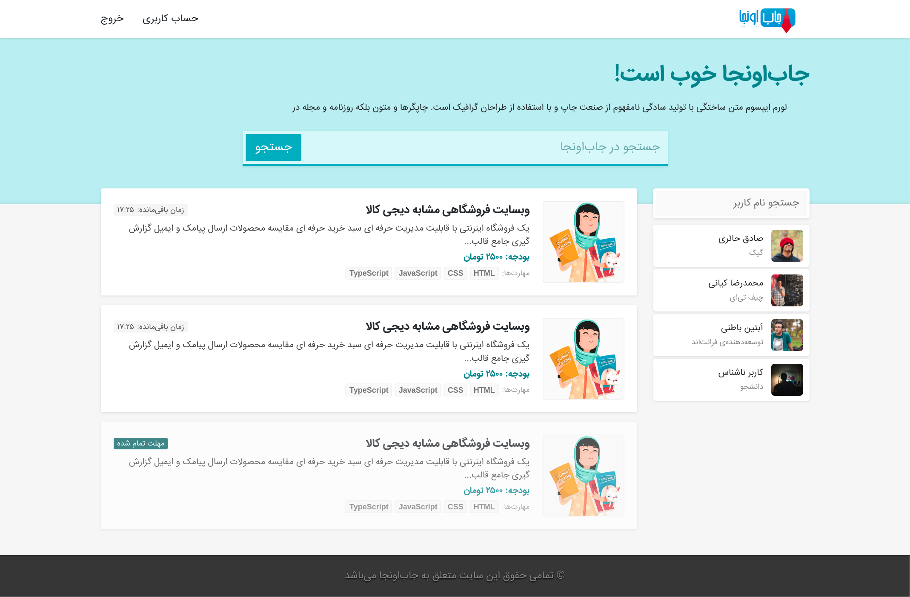

 

  

  <h3 align="center">JobOonja!</h3>

  

    Internet Engineering Course Project - Spring 2019 - University of Tehran
    

<!-- TABLE OF CONTENTS -->

  
Table of Contents

  <ol>
    <li>
      <a href="#about-the-project">About The Project</a>
    </li>
    <li>
      <a href="#built-with">Built With</a>
    </li>
    <li><a href="#useful-links">Useful Links</a></li>
    <li><a href="#contact">Contact</a></li>
  </ol>

<!-- ABOUT THE PROJECT -->
## About The Project

JobOonja functions as a job-matching platform similar to <a href="https://jooble.org/">Jooble</a> and <a href="https://jobinja.ir/">Jobinja</a>. Employing an auction-based approach, it matches projects to users. Each project in the system specifies the necessary skills and the maximum payment value. Users possessing varying skill levels bid for projects, and ultimately, the system selects the most suitable user for each project.

The project encompassed various phases. The first phase entailed designing and implementing the program logic and back end using <a hre="https://www.tutorialspoint.com/design_pattern/mvc_pattern.htm">MVC design pattern</a>. The second phase involved crafting the front end design using React. A database for data storage with JPA was also designed, and mechanisms such as JWT, Docker, and Kubernetes were employed.

The front end section of the project resides in this repository, containing all the codes, including the HTML, CSS, and JS files. The back end of the project can also be found in <a href="https://github.com/MNourbakhsh75/IE_CA">this repository</a>.

## Built With

The programming language, frameworks, and technologies used in the project are listed here:

* [Javascript](https://www.javascript.com/)
* [React](https://react.dev/)
* [Json](https://www.json.org/json-en.html)
* [Sass](https://sass-lang.com/)
* [Bootstrap](https://getbootstrap.com/)

(<a href="#top">back to top</a>)

## Useful Links

Some useful links and tutorials about this project can be found in <a href="https://github.com/NegarMirgati/JobInja/tree/master#useful-tutorials">this repository</a>

(<a href="#top">back to top</a>)

<!-- CONTACT -->
## Contact

Mehrdad Nourbakhsh - mehrdad.nb4@gmail.com

(<a href="#top">back to top</a>)

